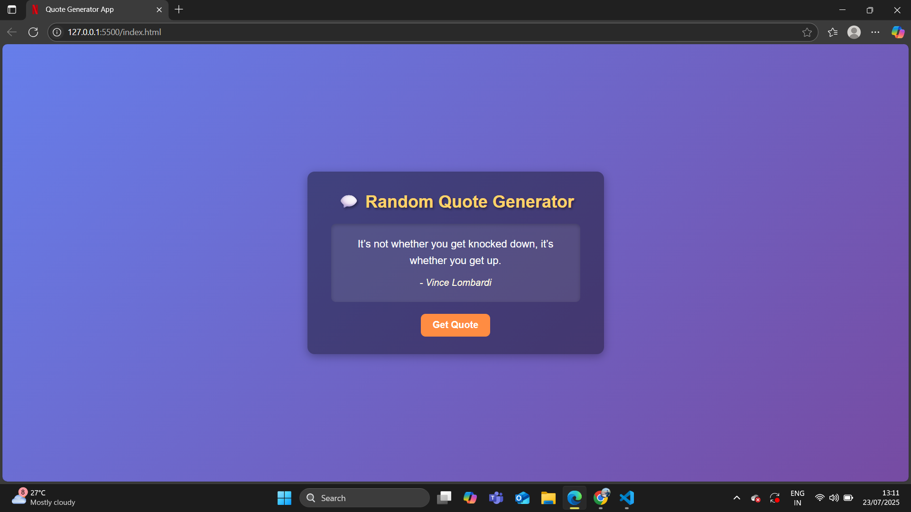

# 💬 Random Quote Generator

A simple and interactive Quote Generator App that displays random quotes at the click of a button.  
This app is built using **HTML**, **CSS**, and **JavaScript**.

---

## 🚀 Live Demo  
[Click Here to View](https://your-live-demo-link.com) 

---

## 📸 Screenshots  
### Home Page  
 

---

## 🛠 Tech Stack  
- **HTML5** – Markup structure
- **CSS3** – Styling & layout
- **JavaScript (ES6)** – Logic for generating random quotes

---

## 📂 Project Structure  
quote-generator-app/
│── index.html
│── style.css
│── script.js
│── screenshot.png
└── README.md

---

## ⚡ Features  
- Displays random motivational quotes.
- Clean, modern, and responsive design.
- Offline quotes array (no API needed).
- Easy-to-understand code.

---

## 🎯 Future Enhancements  
- Add **Copy to Clipboard** button.
- Integrate with external **Quotes API**.
- Add a **Share on Twitter** feature.
- Add background animations.

---

## 📧 Contact  
**Author:** Jaskaran Singh  
- **GitHub:** [jaskaransingh2121](https://github.com/jaskaransingh2121)  
- **Email:** jaskaran2127@gmail.com

